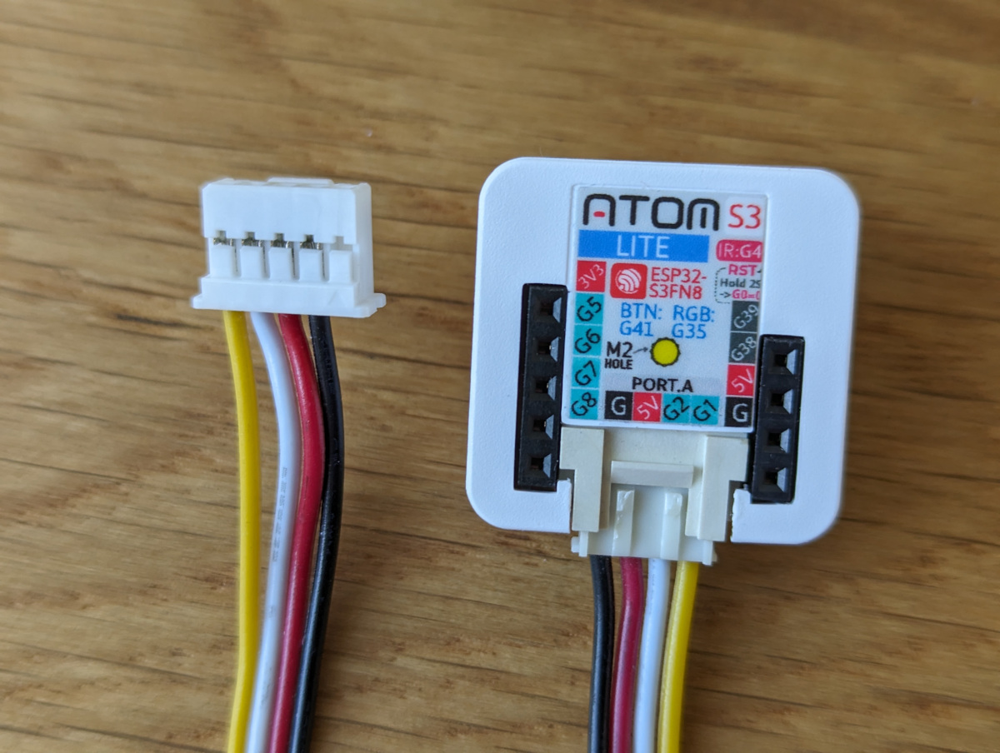

# Cabling

## CN105
Note: Assuming you are using a grove connector, pin 1 is the first pin on the right of the *back* of the connector.

So in the image above, pin 1 is the unconnected pin with the arrow.

Pin 2 --> Ground (Black)
Pin 3 --> 5V (Red)
Pin 4 --> RX (White)
Pin 5 --> TX (Yellow)